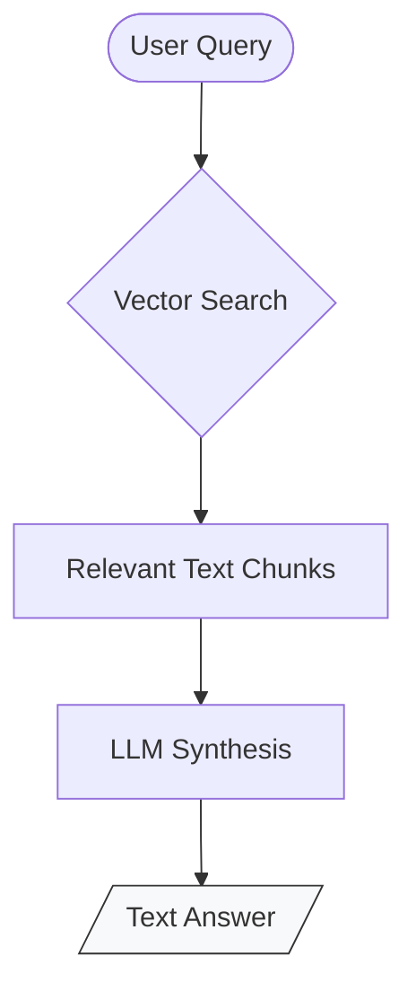
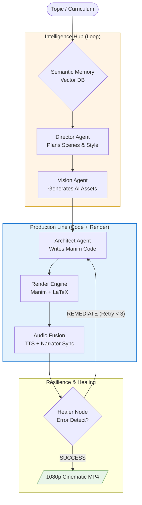

# RAG vs. Autonomous Video Factory: Architecture Comparison

This document defines the structural differences between standard **Retrieval-Augmented Generation (RAG)** and the **Industrial Agentic Video Factory** implemented in this project.

---

## 1. Ordinary RAG Architecture
**Objective**: Text-to-Text response (Chatbot).

---

## 2. Industrial Video Factory Architecture
**Objective**: Industrial-grade, multi-modal video production.

---

## Final Comparison Table

| Feature | Ordinary RAG | **Industrial Video Factory** |
| :--- | :--- | :--- |
| **Output Type** | Text Paragraph | **Cinematic 1080p Video** |
| **Multimodality** | Limited (Text focus) | **Built-in (Images, Audio, Python Code)** |
| **Self-Correction** | None | **Autonomous Healer Agent** |
| **Control** | LLM-driven | **Design-Token & Logic driven** |
| **Goal** | To Inform | **To Teach & Visualize** |
