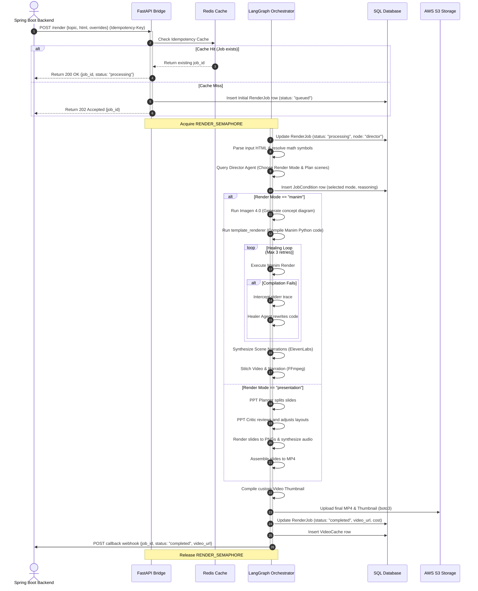

# 🚀 EaseToLearn — Autonomous Video Factory
### Industrial Technical Specification & System Reference Manual

The **EaseToLearn Autonomous Video Factory** is a production-hardened, multi-modal video generation system designed to ingest educational textbook curriculum, syllabus outlines, and raw HTML or JSON solutions, and automatically synthesize highly engaging, mathematically rigorous, and clinically accurate educational videos with zero human intervention.

Structured around a state-of-the-art **Adaptive Agentic RAG** and a robust **LangGraph Orchestration engine**, the system combines real-time metasearch (SearXNG), deep pedagogical concept planning, mathematical animation compiling (Manim/LaTeX), neural voice synthesis (ElevenLabs), generative image/video diffusion, talking head rendering (HeyGen), and an autonomous self-correcting compiler loop (Healer Agent) to produce broadcast-ready 1080p videos.

---

## 🗂️ Project Directory Structure

To keep the workspace clean and highly professional, the codebase has been structured into intuitive top-level directories:

*   **[`academic_presets/`](file:///Users/apple/Desktop/easetolearn.videogeneration/academic_presets/)**: Contains raw educational lesson texts, curriculum source HTMLs, bulk JSON inputs, and academic guides used for preset rendering and testing.
*   **[`docs/`](file:///Users/apple/Desktop/easetolearn.videogeneration/docs/)**: Holds internal documentation, architecture blueprints, system guides (like operations runbooks, pipeline definitions), and diagnostic bug audits.
*   **[`scratch/`](file:///Users/apple/Desktop/easetolearn.videogeneration/scratch/)**: Holds developer sandbox scripts, one-off verification files, experiment drafts, and transient outputs.
*   **[`scripts/`](file:///Users/apple/Desktop/easetolearn.videogeneration/scripts/)**: Contains core administrative tools, smoke tests, database migration scripts, and utility commands (such as the automated smoke runner or disk hygiene tools).
*   **[`tests/`](file:///Users/apple/Desktop/easetolearn.videogeneration/tests/)**: Consists of the official unit and integration test suites, ensuring maximum quality control and system stability.
*   **[`utils/`](file:///Users/apple/Desktop/easetolearn.videogeneration/utils/)**: Python utility packages containing cross-cutting helper components (like Slack telemetry alert systems and image compositing tools).
*   **`nodes/`** / **`ppt_engine/`** / **`db/`** / **`caching/`**: Modular logic layers managing state transition steps, slide compilers, ORM models, and Redis integrations.

---

## 🗂 Master Architecture Schematic

```text
==================================================================================================
                           EASETOLEARN VIDEO FACTORY - COMPLETE PIPELINE MAP
==================================================================================================

        [ SPRING BOOT INTEGRATION ]              [ FASTAPI GATEWAY ]
          POST /render {html, topic}  ────────▶   - Verify X-API-Key
                                                 - Check Idempotency Cache
                                                 - Lock RENDER_SEMAPHORE (Max 2 CPU slots)
                                                 - Spawn Worker Thread
                                                           │
                                                           ▼
                                                [ THE STATE GRAPH ENGINE ]
                                                   (autonomous_graph.py)
                                                           │
                                                           ▼
                                                [ ① DIRECTOR AGENT ]
                                                - Parse Input HTML/JSON
                                                - Retrieve local KB Ground Truth
                                                - Trigger SearXNG loop if sparse
                                                - Select Render Mode & Pose Maps
                                                           │
                      ┌────────────────────────────────────┼──────────────────────────────────┐
                      ▼                                    ▼                                  ▼
             [ ② MANIM SCIENTIFIC ]               [ ② PRESENTATION ]                 [ ② TALKING HEAD ]
             - Imagen Concept diagram             - Slide Layout Critic              - HeyGen Avatar Sync
             - math_tex_safe() Compilation        - Groq PPT Planner                 - Kinetic Subtitles
             - Healer loop (Max 3 retries)        - Slide Render & TTS               - Video Fusion Stitch
                      │                                    │                                  │
                      └────────────────────────────────────┼──────────────────────────────────┘
                                                           │
                                                           ▼
                                               [ ③ AUDIO STITCH & FUSION ]
                                               - Align Whisper timestamps
                                               - FFmpeg multi-channel mix
                                               - Generate custom Thumbnail
                                                           │
                                                           ▼
                                                  [ ④ CLOUD DEPLOY ]
                                               - Stream S3 Upload (Boto3)
                                               - Save to SQL Video Cache
                                               - Trigger Webhook callback
                                               - Release Semaphore
==================================================================================================
```

---

## 🧩 Point-to-Point Component Breakdown

### 1. Gateway & Queueing: `api_bridge.py`
The FastAPI application serves as the primary gateway, handling intake validation, resource limits, and async dispatching.
*   **Security Sentinel (`verify_api_key`)**: Mandates and validates the `X-API-Key` header against `FACTORY_API_KEY`. Requests failing authentication are rejected immediately with a `403 Forbidden` status.
*   **Idempotency Protection (`_idempotency_lookup`)**: Uses stable sorting of payloads and overrides to hash a unique key. If a duplicate request is received within the 1-hour TTL, the system short-circuits to return the existing job id, preventing double billing on network retries.
*   **ECS Semaphore (`RENDER_SEMAPHORE`)**: Limits concurrent video rendering tasks to exactly **2 concurrent threads**. This prevents memory exhaustion (OOM) inside AWS ECS Fargate containers during CPU-heavy Manim and MoviePy compilation jobs.
*   **Dynamic CORS Security**: Configures explicit allowed origins mapped from the environment. Falls back to a strict warning mode if security keys are left unconfigured.
*   **Static Endpoint Mounts**: Mounts the local `assets` directory for system fonts and the custom dashboard GUI under the `/portal` mount point.
*   **Range-Aware Streaming**: Exposes `/stream/{job_id}/{filename}` with full byte-range support, allowing clients to seek and stream locally compiled videos efficiently.

### 2. State Orchestrator: `autonomous_graph.py`
Constructed using LangGraph, this orchestrator manages global state changes through a centralized transaction container (`TonyState`).
*   **The State Schema (`TonyState`)**:
    *   `raw_input` / `topic` / `job_id`: Input request details.
    *   `render_mode` / `scenes`: Ingested routing decisions from the Director.
    *   `ledger`: Normalized dict accumulating API costs in real-time.
    *   `media_manifest` / `rejected_attempts`: Quality loops and historical attempts for self-correction.
*   **Director Node**: Parses curriculum input into unified factual blocks, matches local vector DB definitions, and queries Claude/Gemma to establish scene arrays and styles.
*   **Vision Node**: Coordinates with Gemini Imagen to synthesize conceptual illustrations when complex mechanical or biological structures are detected.
*   **Architect Node**: Evaluates the selected render path, routing to `template_renderer.py` for mathematical equations or down to the slides engine.
*   **Supervisor Node**: Controls the execution of standard compilation processes, calling ffmpeg, TTS synthesis libraries, and assembling individual clips.
*   **Healer Node**: Evaluates errors during the compilation stage and activates corrective feedback.

### 3. Intelligence & Planner: `director_agent.py`
This module represents the intellectual router, responsible for determining the optimal pedagogical presentation method.
*   **Pedagogical Hierarchy**:
    1.  **Level 1 (Manim)**: Chosen for Math, Physics, Chemistry, and Biology. Mandated when formulas, anatomical diagrams, blood flow, or calculation steps are present.
    2.  **Level 2 (Explainer)**: Chosen for conceptual metaphors (e.g., ticking clocks or dominoes) where raw mathematical datasets are absent.
    3.  **Level 3 (User Generated)**: Triggered for face-to-face tutoring instructions. Uses full talking avatars.
    4.  **Level 4 (Presentation)**: Fallback default. Used for UPSC essays, Case Studies, English Grammar, and Geography.
    5.  **Level 5 (Notes)**: Configures single-page revision sheets and cheat-sheet graphics.
    6.  **Level 6 (Explainer Slides)**: Connects conceptual slides under a hand-drawn "Whiteboard Doodle" style.
*   **MCQ Alignment Rules**: If curriculum type is detected as `"mcq"`, the Director is strictly constrained to append four consecutive scenes at the absolute end of the storyboard: `mcq_layout` $\rightarrow$ `option_highlight` $\rightarrow$ `cross_out` $\rightarrow$ `answer_reveal`. No conceptual slides may interrupt this sequence.
*   **Tone & Character Maps (`tony_pose`)**: Dynamically binds cartoon avatar character states (e.g., `standing_point_up` for rules, `thinking` for derivations, `confused` for common errors, `victory` for answers) to specific learning sequences.

### 4. Deterministic Compiler: `template_renderer.py`
Rather than relying on unreliable LLMs to generate python code directly, this module uses a highly engineered, deterministic compiler to map scenes into flawless Manim scripts.
*   **Typographical Safety (`tex()`)**: Standardizes all written text inside LaTeX text macros (`Tex(r"\\text{...}")`), avoiding plain `Text()` blocks to preserve unified, elegant rendering.
*   **Math Sanitization (`math_tex_safe()`)**: Resolves JSON escape collisions. For example, it prevents python from interpreting LaTeX `\theta` or `\frac` strings as a tab (`\t`) or form-feed (`\f`) by escaping them to `\\theta` and `\\frac` before passing them to the compiler. It also translates raw Unicode characters (e.g., `ω`, `θ`, `Δ`) into corresponding LaTeX macros.
*   **Math Environment Routing (`math()`)**: Detects the presence of raw inline math delimiters (`$`) in mathematical inputs. If present, it automatically routes the string to the `Tex` engine; if absent, it uses `MathTex` (which wraps text in standard math environments). This eliminates compiler crashes caused by nesting math blocks within math environments.
*   **3Blue1Brown Theme Tokens**: Integrates high-contrast, premium 3B1B design tokens (`BLUE = "#58ADFF"`, `GREEN = "#77DD77"`, `RED = "#FF6666"`, `YELLOW = "#FFFF66"`) to color coordinate derivations and highlight correct answers.

### 5. Resilient Self-Repair: `healer_agent.py`
The QA loop safeguards the system from rendering exceptions caused by unexpected edge cases.
*   **Error Catching**: When a Manim compile process crashes, the pipeline intercepts the error trace from `stderr` along with the faulty python script.
*   **Remediation Logic**: The code, the log, and the original lesson facts are passed to the Healer Agent. The Healer recognizes mismatched braces, unescaped LaTeX symbols, or coordinate overlap bugs, and writes a corrected version.
*   **Loop Guard**: Restricts healing loop retries to exactly 3 attempts. If all 3 fail, the system falls back gracefully to standard Presentation mode or outputs a detailed `rendering_error` log, preventing infinite execution loops.

### 6. Usage Accounting: `cost_tracker.py`
Tracks and records token metrics, keeping operations transparent and budget-compliant.
*   **Provider Pricing Matrices**: Integrates actual per-million token costs for all primary models (GPT-4o, Claude 3.5 Sonnet, Claude 3 Opus, Gemini Pro, Groq Llama-3).
*   **Flat Fee Ledgering**: Records flat fees for ancillary processes (e.g., `$0.005` per search, `$0.02` per grounding call, `$0.20` per lip-sync).
*   **Synchronous Persistence**: Appends entries immediately to a local `cost_records.jsonl` file and streams them directly into the SQL database (`job_token_usage` table).
*   **Sunk Cost Protection**: Ensures that if a rendering job fails midway, all API calls executed before the crash are preserved and logged. Webhook error notifications include a `usd_cost` field representing costs incurred up to the point of failure.

### 7. Persistent Cache: `caching/redis_client.py`
Provides state caching to eliminate redundant remote calls and maintain performance.
*   **Graceful Pass-through**: Integrates connection probes and socket connect timeouts (2s limit). If Redis is offline, the module logs a warning and degrades gracefully, operating as a pass-through layer rather than crashing the system.
*   **Canonical Key Hashing**: Standardizes payload sorting (`sort_keys=True`) before generating SHA256 hashes to prevent cache misses caused by arbitrary dict formatting.

### 8. Relational Layer: `db/`
Manages connections to local or remote database instances, supporting both local dev and production workloads.
*   **Database URL Resolver**: Detects the active environment. Local runs default to local SQLite (`factory_jobs.db`). Production deployments fail loudly if the MySQL `DATABASE_URL` is missing.
*   **Pool Performance Settings**: Optimized connection pooling limits (maximum 5 active sockets, 10 overflow connections) designed to perform within ECS Fargate container constraints. Includes connection pre-pings to detect stale sockets.
*   **Tables**:
    *   `render_jobs`: Houses status, error codes, timings, and storage locations.
    *   `job_conditions`: Stores the Director's path selection routing results and flags.
    *   `job_token_usage`: Contains granular usage records (input/output tokens, characters, costs).
    *   `video_cache`: Registers finalized videos by MD5 payload hash to return cached assets for identical future inputs.

---

## 🔄 End-to-End Execution Flow



---

## 🚨 Edge-Case Safeguards & Resilience

### 1. LaTeX Collision Remediation
`MathTex` strings in Manim compile inside a standard `\begin{align*}` block. If the original curriculum text contains plain inline math symbols (e.g. `$` variables), compiler rendering crashes because equations cannot be nested inside equations.
*   **The Guard**: `template_renderer.py` scans strings before rendering. If a `$` delimiter is detected, it routes the text blocks to standard `Tex()` blocks (which handle raw LaTeX and inline math markers correctly).

### 2. Orphaned Process Prevention
Complex Manim rendering or FFmpeg rendering tasks can occasionally freeze, leaving processes hung.
*   **The Guard**: Process executions are started using the `start_new_session=True` argument. This makes the parent the leader of a separate process group. If the execution timeout expires (e.g. 600s), the system calls `os.killpg()` on the process group ID, terminating the parent and all related child processes instantly.

### 3. Audio Narration & Alignment Failures
When overlaying narration audio onto generated slides or animations, variations in speech rate can sometimes cause misalignment.
*   **The Guard**: `dub_pipeline.py` integrates a **Whisper Aligner** system. This system identifies word-by-word timestamp coordinates in narration audios and matches them to visual keyframes. If subtitle creation fails, the system defaults to the original, clean narrator video rather than failing the job.

### 4. API Rate Limit Fallbacks
External APIs (e.g., ElevenLabs, Groq, Gemini) can hit rate limits or experience transient outages.
*   **The Guard**:
    *   If Groq hits a rate limit during PPT slide generation, the system falls back to a deterministic text splitter.
    *   If ElevenLabs narration is unavailable, the pipeline falls back to the native system TTS tool (e.g., Mac `say`) to complete the audio track.
    *   If AWS S3 uploads fail after three linear retries, the system saves the file locally and returns a `file://` URI to ensure the compiled video is not lost.

---

## 🛠️ Deployment & Operations Guide

### 1. Configuration Setup
Create a local `.env` configuration file from the template:
```bash
cp .env.example .env
```
Ensure the following variables are configured for your environment:
*   `FACTORY_API_KEY`: The authorization token matched in the `X-API-Key` headers.
*   `DATABASE_URL`: Connection string. Local development uses local SQLite (`sqlite:///./factory_jobs.db`), while production requires MySQL (`mysql+pymysql://...`).
*   `ENV`: Set to `production` or `dev`.
*   `REDIS_URL`: Endpoint for Redis caching (e.g., `redis://localhost:6379/0`).

### 2. Running locally (Development)
Install dependencies and run the FastAPI bridge using Uvicorn:
```bash
pip install -r requirements.txt
uvicorn api_bridge:app --host 0.0.0.0 --port 8000 --reload
```
Access points:
*   **Interactive API documentation**: `http://localhost:8000/docs`
*   **Observability Portal**: `http://localhost:8000/portal`

### 3. Production Deployment (Docker + ECS Fargate)
Build and run the container locally or push it to your registry:
```bash
# Build
docker build -t easetolearn-video-factory .

# Run
docker run -p 8000:8000 --env-file .env easetolearn-video-factory
```

### 4. Storage & Cache Housekeeping
Generating high-definition video files can quickly consume disk space.
*   **Disk Hygiene Script**: Periodically execute the disk hygiene module to clean up temporary video and image files in the staging directories:
    ```bash
    python3 scripts/test_disk_hygiene.py
    ```
    This script evaluates the age of files in the `output/` directory, purging temporary assets older than the hours specified in `HYGIENE_RETENTION_HOURS` to prevent container disk exhaustion.
*   **Health Probes**: Set your load balancer's target health check to the `/health` endpoint. This endpoint verifies database connection pools, local disk availability, and queue state to ensure the container is responsive.
